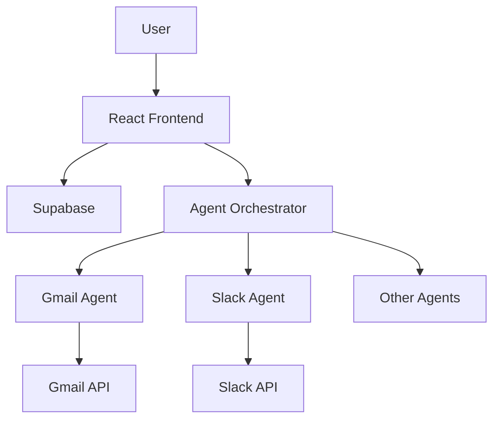

# Vidvas AI - Developer Guide

## Architecture Overview



## Core Components

### Agent Orchestrator
**Location:** `src/lib/agents/AgentOrchestrator.ts`

**Purpose:** Coordinates multiple AI agents

**Usage:**
```typescript
import { orchestrator } from './lib/agents/AgentOrchestrator';

const result = await orchestrator.executeTask(
  'Send an email to user@example.com',
  userId
);
```

### Supabase Service
**Location:** `src/lib/supabaseAgentService.ts`

**Purpose:** Database operations

**Usage:**
```typescript
import { agentPersonaService } from './lib/supabaseAgentService';

// Create persona
const persona = await agentPersonaService.create({
  name: 'My Persona',
  description: 'Description',
  instructions: 'Instructions',
  // ...
});

// Get all personas
const personas = await agentPersonaService.getAll();
```

### OAuth Service
**Location:** `src/lib/oauthService.ts`

**Purpose:** Handle OAuth flows

**Usage:**
```typescript
import { initiateOAuth, handleOAuthCallback } from './lib/oauthService';

// Start OAuth flow
initiateOAuth('gmail');

// Handle callback
await handleOAuthCallback('gmail', code);
```

## Creating Custom Agents

### 1. Create Agent Class

```typescript
// src/lib/agents/CustomAgent.ts
export class CustomAgent {
  async execute(action: string, input: any) {
    switch (action) {
      case 'custom_action':
        return await this.performCustomAction(input);
      default:
        throw new Error(`Unknown action: ${action}`);
    }
  }

  private async performCustomAction(input: any) {
    // Your logic here
    return { success: true, data: {} };
  }
}
```

### 2. Register Agent

```typescript
// In AgentOrchestrator.ts
import { CustomAgent } from './CustomAgent';

private initializeAgents() {
  this.agents.set('CustomAgent', new CustomAgent());
}
```

### 3. Use in Workflows

```typescript
const workflow = {
  steps: [
    {
      agent: 'CustomAgent',
      action: 'custom_action',
      input: { /* your input */ }
    }
  ]
};
```

## Database Schema

### Tables

**agent_personas**
- Stores AI personalities
- Fields: `name`, `description`, `instructions`, `connected_apps`

**agent_workflows**
- Stores workflow definitions
- Fields: `name`, `trigger`, `steps`, `status`

**agent_executions**
- Stores execution history
- Fields: `workflow_id`, `status`, `steps`, `duration`

**agent_integrations**
- Stores OAuth tokens
- Fields: `integration_name`, `access_token`, `status`

## Environment Variables

```env
# Required
REACT_APP_SUPABASE_URL=
REACT_APP_SUPABASE_ANON_KEY=

# OAuth (Optional)
REACT_APP_GOOGLE_CLIENT_ID=
REACT_APP_SLACK_CLIENT_ID=
REACT_APP_GITHUB_CLIENT_ID=
```

## API Examples

### Create and Execute Workflow

```typescript
import { agentWorkflowService, agentExecutionService } from './lib/supabaseAgentService';

// Create workflow
const workflow = await agentWorkflowService.create({
  name: 'Daily Report',
  description: 'Generate daily metrics report',
  trigger: { type: 'scheduled', config: { cron: '0 9 * * *' } },
  steps: [
    { id: '1', agent: 'DataAgent', action: 'fetch_metrics', config: {} },
    { id: '2', agent: 'ReportAgent', action: 'generate_report', config: {} }
  ],
  status: 'active'
});

// Execute workflow
const execution = await agentExecutionService.create({
  workflow_id: workflow.id,
  workflow_name: workflow.name,
  trigger_type: 'manual',
  status: 'running',
  steps: []
});
```

### Manage Integrations

```typescript
import { agentIntegrationService } from './lib/supabaseAgentService';

// Get all integrations
const integrations = await agentIntegrationService.getAll();

// Check if connected
const gmail = await agentIntegrationService.getByName('gmail');
if (gmail?.status === 'connected') {
  // Use integration
}
```

## Testing

### Unit Tests
```bash
npm test
```

### Integration Tests
```bash
npm run test:integration
```

## Deployment

See [deployment_guide.md](../deployment_guide.md) for production deployment instructions.
